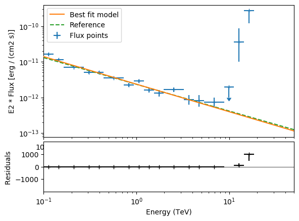
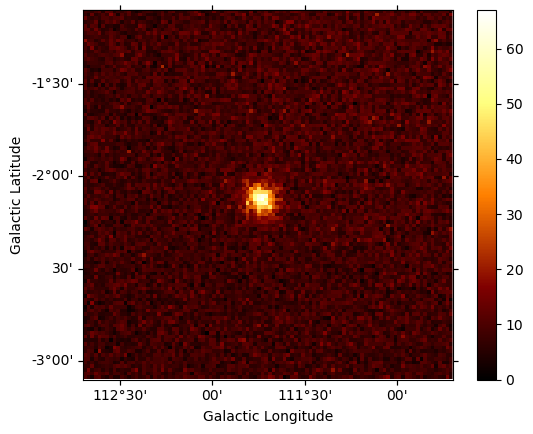
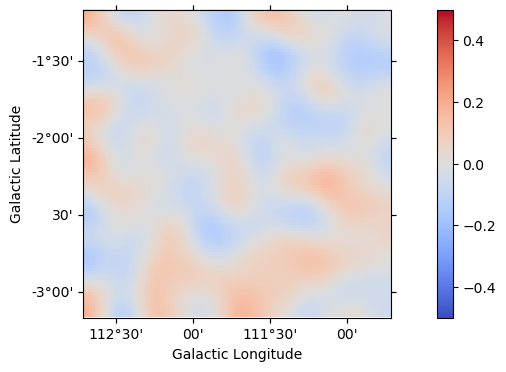

<html>
 <head>
  <meta charset="utf-8"/>
  <meta content="text/html;charset=UTF-8" http-equiv="Content-type"/>
 </head>
 <body>
  <table>
   <thead>
    <tr>
     <th>Param</th>
     <th>DC1 Ref</th>
     <th>gammapy 3d</th>
    </tr>
   </thead>
   <tr>
    <td>lon_0</td>
    <td>111.734</td>
    <td>111.7±0.001558</td>
   </tr>
   <tr>
    <td>lat_0</td>
    <td>-2.129</td>
    <td>-2.127±0.001549</td>
   </tr>
   <tr>
    <td>index</td>
    <td>2.75</td>
    <td>2.776±0.03091</td>
   </tr>
   <tr>
    <td>amplitude</td>
    <td>1.45e-12</td>
    <td>1.466e-12±6.3e-14</td>
   </tr>
  </table>
 </body>
</html>

 
 
 