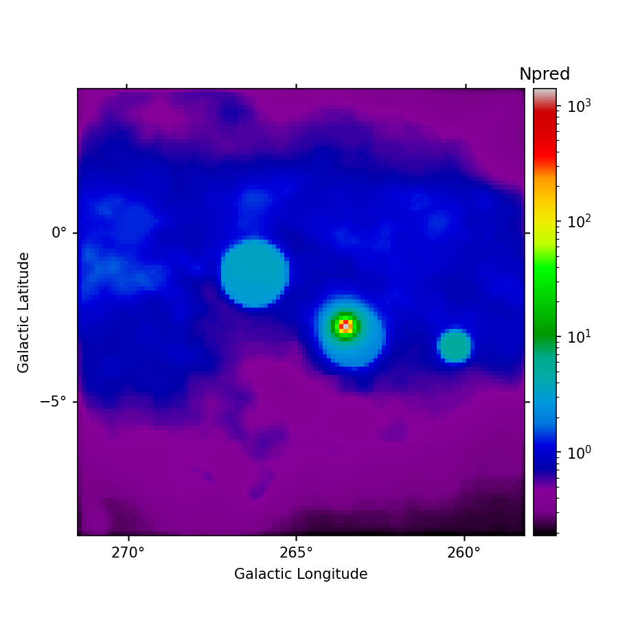
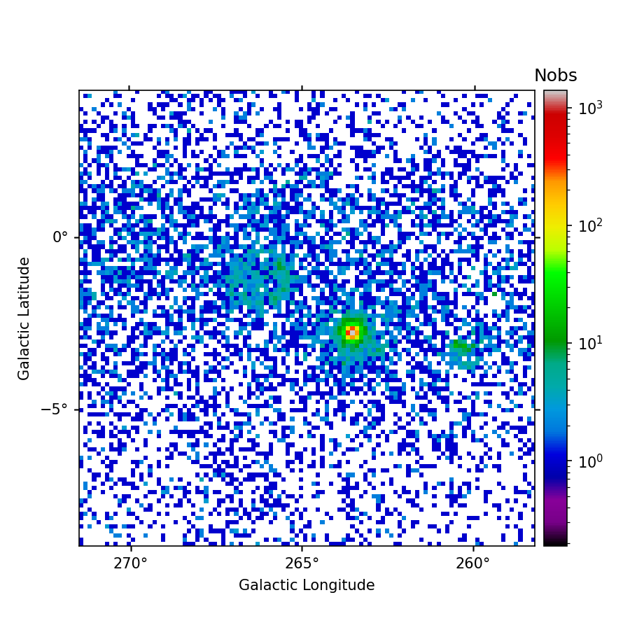
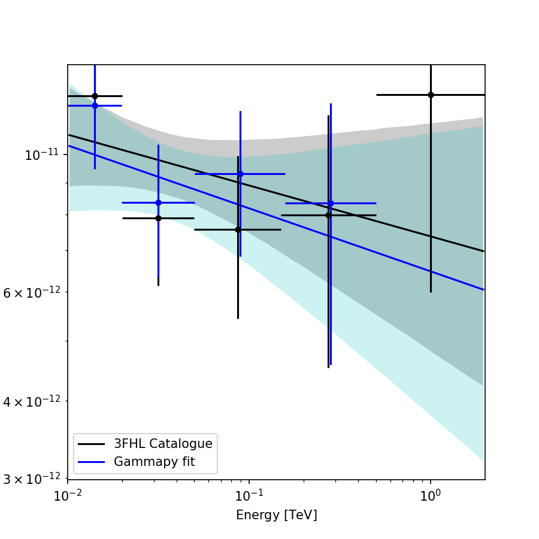
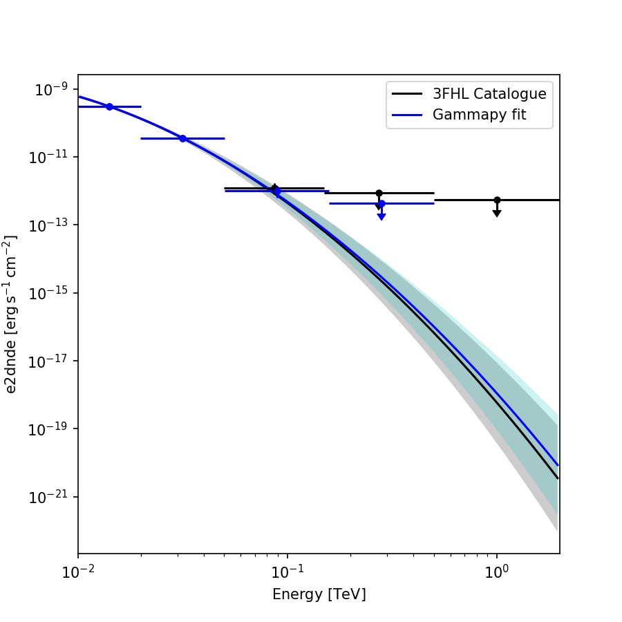
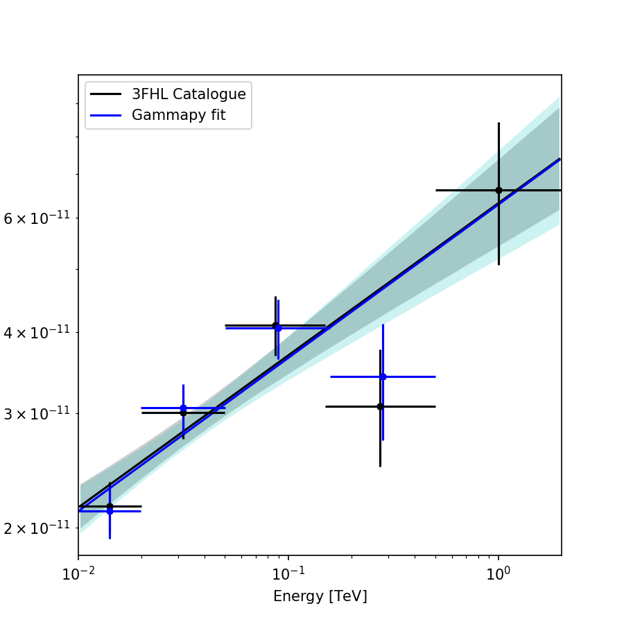

 Vela region 

 

 

 

 

 

 

 All following values are given in percent 

Optimization terminated successfully. 97.9381443298969  
Optimization failed. 0.0  
Optimization failed. Estimated distance to minimum too large. 2.0618556701030926  

 

flux_points  
Rel. err. <10%: 61.971830985915496  
Rel. err. <30%: 91.72535211267606  
Rel. err. mean: -5.8491302077856595  

 

PL_index  
dx/x <10% :  72.25806451612904  
dx/x <30% :  99.35483870967742  
Rel. err. <10%: 99.35483870967742  
Rel. err. <30%: 100.0  
Rel. err. mean: -0.1633147376900733  
compatibility: 100.0  

 

 

 

PL_amplitude  
dx/x <10% :  49.67741935483871  
dx/x <30% :  99.35483870967742  
Rel. err. <10%: 95.48387096774194  
Rel. err. <30%: 100.0  
Rel. err. mean: -0.22198785615526734  
compatibility: 98.06451612903226  

 

 

 

LP_alpha  
dx/x <10% :  76.47058823529412  
dx/x <30% :  100.0  
Rel. err. <10%: 100.0  
Rel. err. <30%: 100.0  
Rel. err. mean: 0.15134907307517098
compatibility: 100.0

 

 

 

LP_beta  
dx/x <10% :  47.05882352941177  
dx/x <30% :  64.70588235294117  
Rel. err. <10%: 76.47058823529412  
Rel. err. <30%: 100.0  
Rel. err. mean: -4.091718544272052  
compatibility: 100.0  

 

 

 

LP_amplitude  
dx/x <10% :  82.3529411764706  
dx/x <30% :  100.0  
Rel. err. <10%: 100.0  
Rel. err. <30%: 100.0  
Rel. err. mean: -1.3330366391977653  
compatibility: 100.0  

 

 

 
