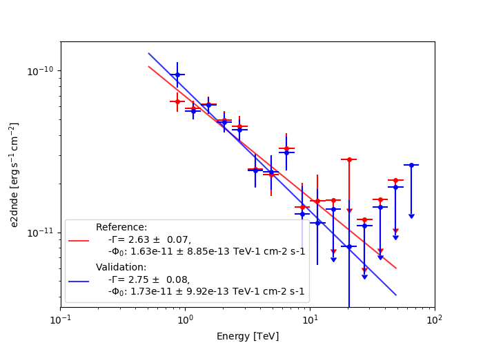

# Gammapy validation: HESS DL3 DR1 and validation paper

Validation of high-level analysis of HESS DL3 data.

## Analyses

- Implemented analyses: 1d (joint analysis) 3d (stacked analysis) / [script](make.py)
- Plotting: [script](plot.py)

## Results:
- Crab:
    - 1d :
        - fit results: 
    [reference](crab/reference/gammapy_crab_1d_powerlaw.dat), 
    [results](crab/results/results-summary-fit-1d.yaml) 
        - flux points:
    
    - 3d: 
        - fit results: 
    [reference](crab/reference/gammapy_crab_3d_powerlaw.dat), 
    [results](crab/results/results-summary-fit-3d.yaml) 
        - flux points: 
    
- PKS 2155-304:
    - 1d /
        - fit results:  
    [reference](pks2155/reference/gammapy_pks2155_1d_powerlaw.dat), 
    [results](pks2155/results/results-summary-fit-1d.yaml) 
        - flux points:
    
    - 3d / 
        - fit results:     
    [reference](pks2155/reference/gammapy_pks2155_3d_powerlaw.dat), 
    [results](pks2155/results/results-summary-fit-3d.yaml)
        - flux points:
    
- MSH 1552:
    - 1d / 
        - fit results:     
    [reference](msh1552/reference/gammapy_msh1552_1d_powerlaw.dat), 
    [results](msh1552/results/results-summary-fit-1d.yaml)
        - flux points:
    
    - 3d / 
        - fit results:     
    [reference](msh1552/reference/gammapy_msh1552_3d_powerlaw.dat), 
    [results](msh1552/results/results-summary-fit-3d.yaml)
        - flux points:
    
- RXJ1739-3946:
    - 1d / Not implemented
    - 3d / Not implemented
    

## Execution

To run a all analyses use:

    python make.py run-analyses all-targets all-methods 
    
To run the analysis (both 1d and 3d) for a specific source use:

    python make.py run-analyses crab all-methods
    
To run only e.g. 1d analysis, for all targets use:

    python make.py run-analyses all-targets 1d

To run in debug mode (quickly):

    python make.py run-analyses all-targets all-methods --debug
    
To produce the plots (for now, only spectral points are plotted):
    
    python plot.py
    
## Results discussion
First of all notice that, for the sake of time (and code lines) saving, the validation that is implemented in `make.py`
 is a rather simplified version of the analysis that is performed in the reference paper. The main simplification 
 consists in the fact that we run a 3d "stacked" analysis, as opposed to a (much longer) "joint" one.

The fit results are generally in acceptable (sometimes even good) agreement with the reference values. 

## TODO
Some important pieces are still missing in the  gammapy HLI. Therefore there are a few TODOs (to be addressed 
in gammapy):
 - During data reduction, apply (run-by-run) a safe mask using the proper `methods`. Right now, the choice of the
  `method` is not customizable from the HLI. A workaround has been implemented
 - Implement a way to set the covariance automatically after the fit
 - For the 3D analysis, re-optimize the background norm in each energy bin. For now, this is not possible from the HLI.
 Notice that only the bkg norm is to be re-fitted (together with the model scaling), therefore all other spatial and 
 spectral parameters have to be frozen (which don't correspond to the default behavior of the `FluxPointsEstimator`
 with the setting `reoptimize=True`).
 - Implement a more uniform units handling schema between the analysis config and the model config: for now, in the former
 something like `10 deg` works, wherheas in the latter the value and units need to be separated.
 
 There are also a few TODOs to address here in this folder:
 - Implement the case of RXJ 1713-3946 (postponed, for now)
 - Make plots for the best-fit spectral models (comparing reference models and results)
 - Adapt the scripts, following the improvements in the HLI

## References

- Dataset (including background models from HESS validation paper): https://github.com/gammapy/gammapy-extra/tree/master/datasets/hess-dl3-dr1
- Lars Mohrmann paper: https://ui.adsabs.harvard.edu/abs/2019arXiv191008088M
  - Results in machine-readable format: https://github.com/lmohrmann/hess_ost_paper_material
