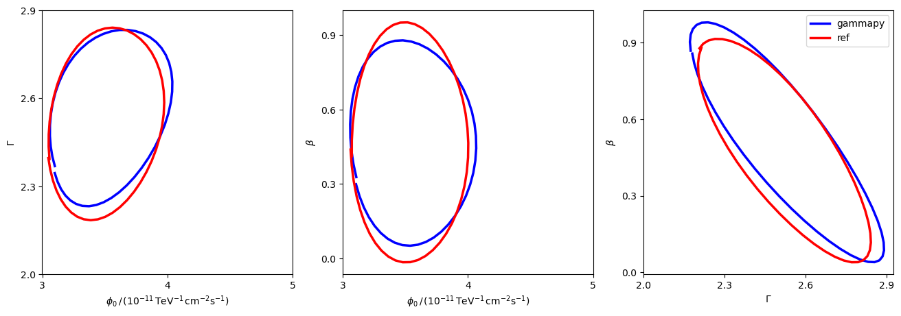

<html>
 <head>
  <meta charset="utf-8"/>
  <meta content="text/html;charset=UTF-8" http-equiv="Content-type"/>
 </head>
 <body>
  <table>
   <thead>
    <tr>
     <th>Param</th>
     <th>joint crab paper</th>
     <th>gammapy</th>
    </tr>
   </thead>
   <tr>
    <td>amplitude</td>
    <td>3.4913981981298186e-11±3.04501</td>
    <td>4.445e-11±3.315e-12</td>
   </tr>
   <tr>
    <td>reference</td>
    <td>1.0±0.0</td>
    <td>1.0±0.0</td>
   </tr>
   <tr>
    <td>alpha</td>
    <td>2.5416332082275495±0.224725826</td>
    <td>3.268±0.2179</td>
   </tr>
   <tr>
    <td>beta</td>
    <td>0.42491692219951577±0.31274328</td>
    <td>-0.29150727277304617±0.2537448</td>
   </tr>
  </table>
 </body>
</html>

 