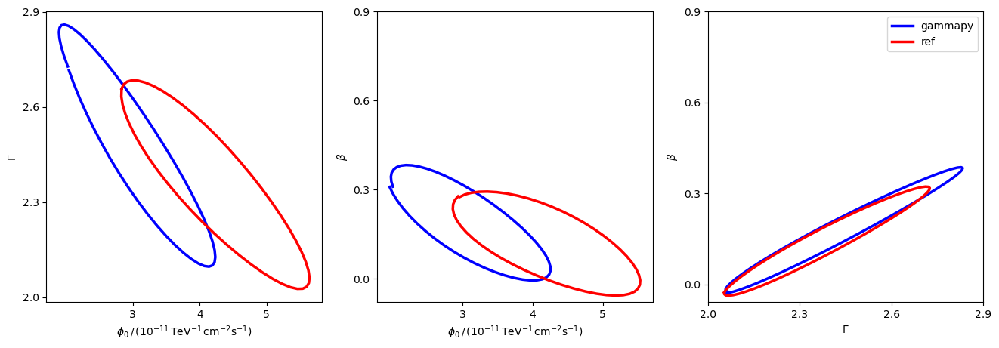

<html>
 <head>
  <meta charset="utf-8"/>
  <meta content="text/html;charset=UTF-8" http-equiv="Content-type"/>
 </head>
 <body>
  <table>
   <thead>
    <tr>
     <th>Param</th>
     <th>joint crab paper</th>
     <th>gammapy</th>
    </tr>
   </thead>
   <tr>
    <td>amplitude</td>
    <td>3.160e-11 ± 7.870e-12</td>
    <td>3.050e-11 ± 7.791e-12</td>
   </tr>
   <tr>
    <td>reference</td>
    <td>1.000e+00 ± 0.000e+00</td>
    <td>1.000e+00 ± 0.000e+00</td>
   </tr>
   <tr>
    <td>alpha</td>
    <td>2.388e+00 ± 2.386e-01</td>
    <td>2.450e+00 ± 2.486e-01</td>
   </tr>
   <tr>
    <td>beta</td>
    <td>1.445e-01 ± 1.273e-01</td>
    <td>1.882e-01 ± 1.346e-01</td>
   </tr>
  </table>
 </body>
</html>

 