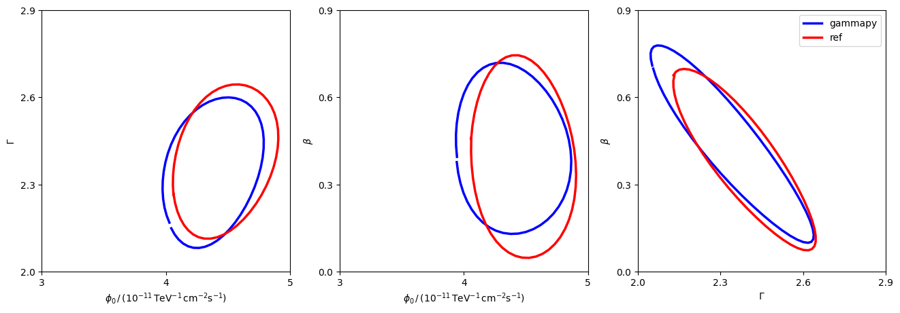

<html>
 <head>
  <meta charset="utf-8"/>
  <meta content="text/html;charset=UTF-8" http-equiv="Content-type"/>
 </head>
 <body>
  <table>
   <thead>
    <tr>
     <th>Param</th>
     <th>joint crab paper</th>
     <th>gammapy</th>
    </tr>
   </thead>
   <tr>
    <td>amplitude</td>
    <td>4.4744069583170896e-11±2.86986</td>
    <td>4.465e-11±2.893e-12</td>
   </tr>
   <tr>
    <td>reference</td>
    <td>1.0±0.0</td>
    <td>1.0±0.0</td>
   </tr>
   <tr>
    <td>alpha</td>
    <td>2.392902850866078±0.1827674479</td>
    <td>2.36±0.1843</td>
   </tr>
   <tr>
    <td>beta</td>
    <td>0.37193003754897236±0.22400954</td>
    <td>0.3838409350021074±0.226321088</td>
   </tr>
  </table>
 </body>
</html>

 