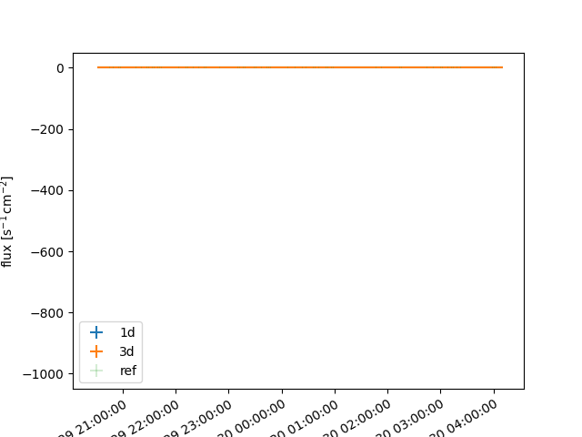

# Light curve validation

Validate gammapy lightcurve extraction for 1D and 3D data reduction.

## Science Use cases covered

- Perform a 1D data reduction 
- Perform a 3D data reduction
- Perform a light curve extraction in several energy bands for each geometry

## Methodology

- Data from the HESS-DL3-DR1 are used. Observations of PKS 2155-304 flare from the night of July 29-30 2006 are extracted from the data library. 
- Data reduction is performed with the regular API.
- Observation runs are split into 10 minutes chuncks before applying data reduction. 
- Analysis pipeline is duplicated between 1D spectral and 3D cube data reduction.
- 1D analysis relies on reflected region background estimation. 3D analysis use field-of-view background estimation.
- A log parabola model from the reference model is used to compute the light curve in the 10 minutes times bins.
- Results are plotted and compared to the [reference](https://ui.adsabs.harvard.edu/abs/2009A%26A...502..749A/abstract)

## Results

### Provenance

See [provenance.yml](results/prov_lightcurve.yaml)

### Comparison with reference

## Reference

- https://ui.adsabs.harvard.edu/abs/2009A%26A...502..749A/abstract

