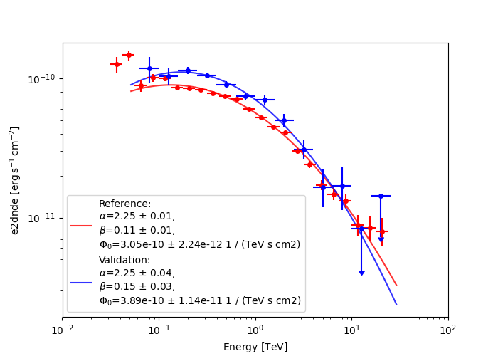

# Gammapy validation: Open Crab DL3 dataset from LST-1

Performs the 1D spectral analysis (with energy-dependent directional cuts) of [DL3 open data sample from LST-1 Crab Nebula observations](https://zenodo.org/records/11445184).

## Analysis

Implemented analysis: 1D spectral joint likelihood analysis [script](make.py)

Plotting: [script](plot.py)


## Results:
- Crab 1D spectral analysis:
  - fit results: 
    [reference](reference/spectral_model.yml), 
    [validation](results/best_fit_model.yml) 
  - plots:
    

## Execution

To run the analysis (including the download of the DL3 files from Zenodo) use:

```
python make.py run-analysis
```
    
To produce the plots with spectral models and flux points comparison:
    
```
python plot.py
```
    
## Results discussion
The DL3 files used here are an updated version of the ones used in the validation study, hence some differences coming from pre DL3 reconstruction are expected.

The fit results are generally in acceptable agreement with the reference values. 

## References

- Used DL3 files are a subset of the sample used in the LST-1 performance study [H. Abe et al 2023 ApJ 956 80]([10.3847/1538-4357/ace89d](https://doi.org/10.3847/1538-4357/ace89d))
- DL3 files openly available at https://zenodo.org/records/11445184
- Results in machine-readable format: https://github.com/cta-observatory/lst-crab-performance-paper-2023
